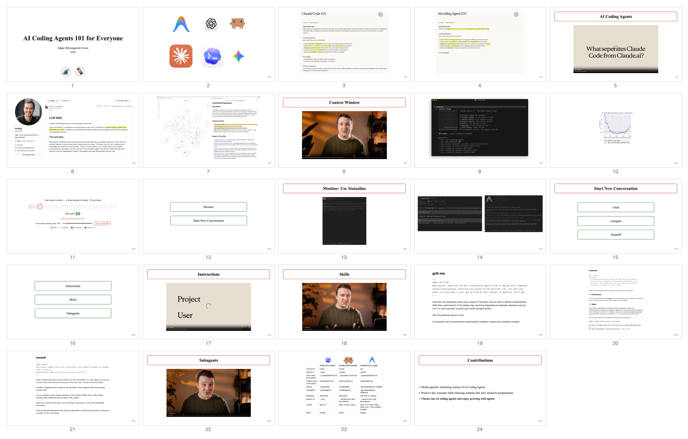

# Presentation

Minimalist, web-based slide decks in the spirit of MIT's Patrick Winston,
*How to Speak* — blank white background, **one font** (Times New Roman),
red-stroke headers, green-stroke list boxes, and nothing else competing for
attention. **Less is more.**

A plain-text `draft.md` becomes a [reveal.js](https://revealjs.com) deck (with
room for hand-coded interactive widgets), and exports to a PDF plus a single
bird's-eye **contact sheet** of every slide.

> One-liner: **`text draft with references → web based slides`**

---

## ▶ Presentations

| Deck | Category | Present (live) | With references | Bird's-eye |
|---|---|---|---|---|
| **AI Coding Agents 101 for Everyone** | teaching | [open ▶](https://myeongseok-gwon.github.io/presentation/teaching/ai-coding-agents-101-for-everyone/index.html) | [open](https://myeongseok-gwon.github.io/presentation/teaching/ai-coding-agents-101-for-everyone/index.ref.html) | [PDF](teaching/ai-coding-agents-101-for-everyone/ai-coding-agents-101-for-everyone.pdf) |

*Tip: arrow keys to navigate. On the context-window slide, drag the slider and
press **Ask** — watch the cost climb as the question sits later, and trigger an
auto-compact when the window is nearly full.*

#### AI Coding Agents 101 — all slides at a glance


---

## How it works

```
Presentation/
  _template/                 shared "General Template" (one source of truth)
    theme.css                all geometry/fonts/box styles (edit :root to retune)
    build.mjs                draft.md  ->  index.html + index.ref.html
    export.mjs               index*.html -> PDF + contact-sheet PNG
    prototype.html           every slide type, for eyeballing the geometry
    vendor/reveal/  fonts/    pinned reveal.js + bundled Tinos (TNR-metric font)
  <category>/<deck>/
    draft.md                 the slide source (you author this)
    assets/                  images, videos, reference.md
    widgets/<slug>.html      hand-coded interactive components
    index.html               generated — present this (no references)
    index.ref.html           generated — citations + auto references page
    <deck>.pdf / .contact.png   exported deliverables
```

Categories: **teaching** (informing), **paper-review** (critiquing a paper),
**paper-presentation** (introducing your own paper).

### Build · present · export

```bash
# 1. build the deck from its draft.md
node _template/build.mjs teaching/ai-coding-agents-101-for-everyone

# 2. present locally (interactive widgets need HTTP, not file://)
npx serve teaching/ai-coding-agents-101-for-everyone    # then open index.html

# 3. export PDF + contact sheet (first run downloads headless Chrome)
cd _template && npm install
node ../_template/export.mjs teaching/ai-coding-agents-101-for-everyone
#   add --scale=2 for a crisp retina/zoomable PDF
```

### The draft grammar (essentials)

Each top-level `- ` line in `draft.md` is **one slide**.

| You write | You get |
|---|---|
| `Title: …, year: …, No Laptops No Cellphones` (first line) | title slide |
| `Header: content` | red-stroke header + content (header ≤ 33 chars) |
| `` `text:text` `` | backticks escape a literal colon |
| `@name.png` / `@clip.mov` | image (fit) / video |
| `@a.png, @b.png` | images side-by-side |
| `@img.png, some prose` | portrait → split, landscape → caption |
| `https://youtu.be/ID?t=90` | embedded YouTube player (timestamp honored) |
| `List - a - b - c` | vertical stack of green-stroke boxes |
| `Implement(slug): …` | inject `widgets/slug.html` (interactive) |
| `Contributions: - a - b - (Takeaway) c` | left-aligned bullets; the takeaway pops last |

Two builds come from one source: `index.html` (no references, for presenting)
and `index.ref.html` (APA author-date citations bottom-left + an auto references
page; DOIs resolved via Crossref/DataCite, other URLs shown as `Source:`).

---

*Built with [Claude Code](https://claude.com/claude-code).*
